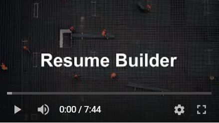
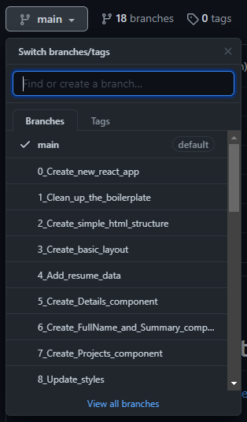

# Resume Builder

I've recently needed to update my resume and I couldn't find any resume builders that would allow me to customize my resume the way I wanted. So I built this small app.

## Short video about the project

[](https://youtu.be/ZJ9f4-03Uqw)

## How I built it?

Each step of building this app is saved as a separate branch so it should be easy to explore the code.



## Getting started

### Clone the repository

```bash
$ git clone https://github.com/sitek94/resume-builder.git
```

### Install the dependencies

```bash
$ yarn install
```

### Run the app

```bash
yarn start
```

### Edit the files in the `src/data` directory
